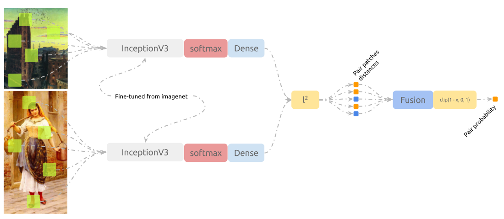
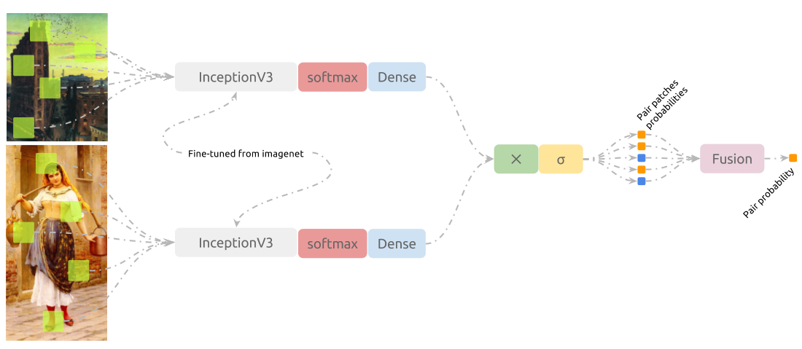

# Connoisseur

Machine Learning experiments on paintings.


“Battle of Grunwald”, Jan Matejko, 1878. From Public Domain.  
Available at: [wikiart.org/en/jan-matejko/battle-of-grunwald-1878](https://www.wikiart.org/en/jan-matejko/battle-of-grunwald-1878).

Check the [INSTALL.md](docs/INSTALL.md) file for instructions on how to
prepare your environment to run connoisseur.


## Installation

### Straight Installation

The simplest way to install connoisseur is the following command:

```shell
$ cd /path/to/connoisseur
$ python3 setup.py install --user
```

As you are installing the package in a global environment, some
incompatibilities might happen.
Try [virtualenv](https://virtualenv.pypa.io/) if that's the case.

### Docker

This method is preferable, as I attached a Dockerfile in this repository.
An image build from the Dockerfile will spawn containers that already have
the correct dependencies to run the experiments.

To use it, build the image:

```shell
$ cd /path/to/connoisseur/docs/
$ docker build -t connoisseur-image .
```

Then run the container and install connoisseur:

```shell
$ nvidia-docker run -it --rm -v /path/to/connoisseur:/connoisseur \
    connoisseur-image /bin/bash
$ cd /connoisseur
$ python setup.py install
```


## Running Experiments

After entering the virtual environment or initiating the docker container,
experiments can be found at the `/connoisseur/experiments` folder. An
execution example follows:

```shell
cd ./experiments/
python 1-extract-patches.py with batch_size=256 image_shape=[299,299,3] \
                                 dataset_name='VanGogh' \
                                 data_dir="./datasets/vangogh" \
                                 saving_directory="./datasets/vangogh/random_299/" \
                                 valid_size=.25
```

This experiment will download, extract and prepare van Gogh's dataset into the
`data_dir` directory. Finally, it will extract patches from all samples and
save them in `saving_directory`.

Each experiment is wrapped by [sacred](http://sacred.readthedocs.io/) package,
capable of monitoring an experiment and logging its progression to a database
or file. To do so, use the `m` or `F` parameter:

```shell
python 1-extract-patches.py -m 107.0.0.1:27017:experiments  # Requires MongoDB
python 1-extract-patches.py -F ./extract-patches/
```

## Reportage

### van Gogh's

van Gogh's dataset is composed by 264 train samples and 67 test samples,
discriminated by the non van Gogh (nvg) and van Gogh (vg) labels.

#### InceptionV3, PCA and SVM

So far, the method responsible for best classification accuracy in the test
set is as follows:


1. `1-extract-patches.py` is used to extract 50 random patches with sizes
(299, 299, 3) from each sample in train and test folders.
2. `4a-embed-patches.py` is executed. Using InceptionV3 architecture and
its weights trained over imagenet dataset, patches are embedded to a lower
dimensional space (cut-point is `GlobalAveragePooling2d(name='avg_pool')` layer).
3. `5-train-top-classifier` trains a PCA --> SVM pipeline that classifies
patches according to their labels.
4. `6-evaluate-fusion` fuses the answers from the model trained above over the
test dataset using each strategy (e.g. sum, mean, farthest, most_frequent) and
reports results. Best values are shown bellow:

   ```
   test score using sum strategy: 0.955223880597

   Confusion matrix:
       nvg  vg
   nvg 39    3
    vg  0   25

   samples incorrectly classified: nvg_10658644, nvg_10500055 and nvg_18195595.
   ```

#### DenseNet264, PCA and SVM

1. `1-extract-patches.py` is used to extract 50 random patches with sizes
(32, 32, 3) from each sample in train and test folders.
2. `2-train-network.py` trains `DenseNet264` over the extracted patches.
3. `3-optional-generate-network-predictions.py` shows the following results:

   ```
   valid patches score using: 0.846538461538
   Confusion matrix:
        nvg   vg
   nvg 1403  197
    vg  202  798

   valid score using farthest strategy: 0.942307692308
   Confusion matrix:
       nvg   vg
   nvg  32    0
    vg   3   17

   test patches score using: 0.842089552239
   Confusion matrix:
        nvg   vg
   nvg 1746  354
    vg  175 1075

   test score using farthest strategy: 0.925373134328
       nvg   vg
   nvg  39    3
    vg   2   23

   samples incorrectly classified: nvg_10658644, nvg_9780042, nvg_6860814,
                                   vg_17177301 and vg_33566806.
   ```

4. `4a-embed-patches.py` is executed. Using DenseNet264 architecture trained
in the previous step, patches are embedded to a lower dimensional space
(cut-point is `GlobalAveragePooling2d(name='avg_pool')` layer).
5. `5-train-top-classifier` trains a PCA --> SVM pipeline that classifies
patches according to their labels. One interesting result here is that PCA
reduces the network output to only 4 dimensions, making the rest of the
classification pipeline very efficient.
6. `6-evaluate-fusion` fuses the answers from the model trained above over the
test dataset using each strategy (e.g. sum, mean, farthest, most_frequent) and
reports results. Best values are shown bellow:

   ```
   test patches score: 0.870149253731

   Confusion matrix:
         nvg   vg
    nvg 1878  222
     vg  213 1037

   test score using mean strategy: 0.910447761194

   Confusion matrix:
         nvg   vg
    nvg   39    3
    vg     3   22

   samples incorrectly classified: vg_33566806, nvg_10658644, vg_17177301, vg_9463608,
                                   nvg_6860814 and nvg_9780042.
   ```

#### Testing on Recaptures

The previous classifiers performed well when applied to the test paintings.
How well would they perform on recaptures of those same paintings?

Things to go over, first:

* Although the recaptures look similar to vgdb_2016 test and their host
  websites say they are indeed the same, small differences are noticeable
  (e.g. the shape of a door, that's more round in one of them than the others;
  patterns that are blurred in an image and very detailed in others). At
  first, I though they were replicas but now I'm not so sure: paintings go
  through revitalization sometimes, which could also explain these
  differences. A specialist might required to validate this?

* When gathering the recaptures dataset, I reached for larger resolutions
  whenever available. Unfortunately, while the vgdb_2016 contains huge files,
  recaptures were hardly bigger than (2000px, 2000px).

  ```
  general statistics on test paintings in vgdb_2016:
    min sizes: (1016 px 1044 px)
    avg sizes: (3115 px 2805 px)
    max sizes: (7172 px 7243 px)
    min  area: 1419840 px^2
    avg  area: 10047495 px^2
    max  area: 45355666 px^2
  ```

##### Patch Extraction Directly from Recaptures

Patches were extracted from the recaptures (as they were), following the previous
pipelines. Results are quite discouraging:

```
Confusion matrix:

               nvg       vg
    nvg    0 (na%)  0 (na%)
     vg   27 (47%) 30 (na%)

samples incorrectly classified: vg_9387502-1, vg_151874-3, vg_9103139-2, vg_9378884-0,
                                vg_9413420-0, vg_9506505-0, vg_9100648-1, vg_9421984-0,
                                vg_9387502-3, vg_9414279-2, vg_9414279-0, vg_9463012-0,
                                vg_9110201-1, vg_9436384-0, vg_9103139-1, vg_9106795-1,
                                vg_9103139-0, vg_9378884-3, vg_9110201-0, vg_9413420-1,
                                vg_9506505-1, vg_9103139-3, vg_9414279-1, vg_22263227-0,
                                vg_9386980-0, vg_9100648-0, vg_9386980-1.
```

##### Resizing and Extraction from the Recaptures

Recaptures are re-sized to match their respective vgdb_2016's test painting's
width, while maintaining aspect ratio. The patches are extracted following the
previous pipelines.

```
Confusion matrix:

               nvg       vg
    nvg    0 (na%)  0 (na%)
     vg   19 (33%) 38 (67%)

samples incorrectly classified: vg_9387502-3, vg_9436384-0, vg_9110201-1, vg_9463012-0,
                                vg_9413420-1, vg_9386980-1, vg_9103139-2, vg_9421984-0,
                                vg_9387502-1, vg_9103139-0, vg_9414279-2, vg_9103139-1,
                                vg_9106795-1, vg_9414279-1, vg_9386980-0, vg_9378884-3,
                                vg_9413420-0, vg_9103139-3, vg_9414279-0.
```

---

### Painter by Numbers

Containing many paintings from 1564 painters, this dataset was made available
in Kaggle's [Painter-by-Numbers](https://www.kaggle.com/c/painter-by-numbers)
competition. We also have access to meta-data associated with the paintings
(e.g. style, genre and year created).

While we can interpret the training phase as a multiclass problem, the test
phase consists in deciding whether or not two paintings belonging to a same
artist.

Score is computed by ROC AUC between an estimated probabilities and the actual
label (0.0 or 1.0).

#### Siamese InceptionV3, PCA, SVC, Equal Joint

The 100 first painters (sorted by their hash code) were considered and the
pipeline described bellow.


We can see from the train confusion matrix and the test report bellow that the
model performed well for the 100 artists selected in training, but clearly
overfitted the data and missed many samples associated with the label
`same-artist`.


```
score using farthest strategy: 0.70295719844

Confusion matrix:

                    different-painters same-painter
different-painters            15289495      6339202
      same-painter              170802       116548
```

#### Siamese Fine-tuned InceptionV3, Custom Joint


1. `1-extract-patches.py` is used to extract 50 random patches with sizes
(299, 299, 3) from each sample in train and test folders.
2. `2-train-network.py` fine-tunes InceptionV3 (transferred from imagenet)
to the train dataset, associating patches to their respective painters.
4. `3a-generate-network-answers` feed-forwards each test painting's test
through the network trained in the previous step. Let `y` be the fined-tuned
InceptionV3 and `a` and `b` be paintings in a pair described in
`submission_info.csv`:
   - **Equal Joint** Patches probabilities are fused using each strategy,
     leaving us with the probabilities of a work belonging to each one of the
     1584 painters. The probability of these being of a same painting is
     computed by `argmax(y(a)) == argmax(y(b))`. Results are shown bellow:

     ```
     roc auc score using mean strategy: ?

     Confusion matrix:

                         different-painters same-painter
     different-painters            21593154        35543
           same-painter              214767        72583
     ```

   - **Dot Joint** patches probabilities are fused using `mean` strategy,
     leaving us with the probabilities of a work belonging to each one of the
     1584 painters. The probability of these being of a same painting is
     computed by `y(a).dot(y(b))`. Results are shown bellow:

     ```
     roc auc score using mean strategy: 0.902789501328

     Confusion matrix:

                         different-painters same-painter
     different-painters            21627458         1239
           same-painter              261844        25506
     ```

   - **Pearsonr Joint** patches probabilities are fused using `mean` strategy,
     leaving us with the probabilities of a work belonging to each one of the
     1584 painters. The probability of these being of a same painting is
     computed by `scipy.stat.pearsonr(y(a), y(b))[0]`. Results are shown bellow:

     ```
     roc auc score using mean strategy: 0.880932204226

     Confusion matrix:

                         different-painters   same-painter
     different-painters     21588252 (100%)    40445  (0%)
           same-painter       207041  (72%)    80309 (28%)
     ```

#### Siamese Fine-tuned InceptionV3, Embedding Dense Layers, l^2 Joint

The limbs of the network trained in [Siamese Fine-tuned InceptionV3, Custom Joint](#siamese-fine-tuned-inceptionv3-custom-joint)
are used to compose a new network (frozen weights), illustrated in the diagram
bellow:



```
roc auc: 0.831379516462
accuracy normalized by class-frequency: 73.5%

Confusion matrix:

                    different-painters   same-painter
different-painters      17965397 (83%)  3663300 (17%)
      same-painter        103340 (36%)   184010 (64%)
```


#### Siamese Fine-tuned InceptionV3, Embedding Dense Layers, Sigmoid Joint

The limbs of the network trained in [Siamese Fine-tuned InceptionV3, Custom Joint](#siamese-fine-tuned-inceptionv3-custom-joint)
are used to compose a new network (frozen weights), illustrated in the diagram
bellow:




```
roc auc using mean strategy: 0.865582232769
accuracy normalized by class-frequency: 78%

Confusion matrix:

                    different-painters   same-painter
different-painters      16418044 (76%)  5210653 (24%)
      same-painter         56919 (20%)   230431 (80%)
```


##### Siamese Multi-label Fine-tuned InceptionV3, Embedding Dense Layers, Sigmoid Joint


```
roc auc score using mean strategy: 0.913406464881
accuracy normalized by class-frequency: 80%

Confusion matrix:

                    different-painters   same-painter
different-painters      20069328 (93%)  1559369  (7%)
      same-painter         95072 (33%)   192278 (67%)
```


##### Siamese Multi-branch Fine-tuned InceptionV3, Embedding Dense Layers, Sigmoid Joints


