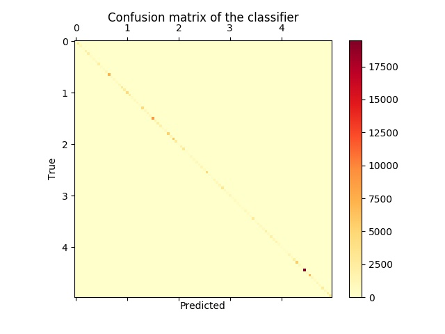
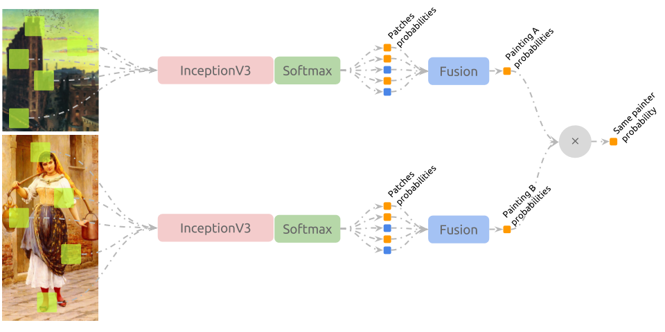
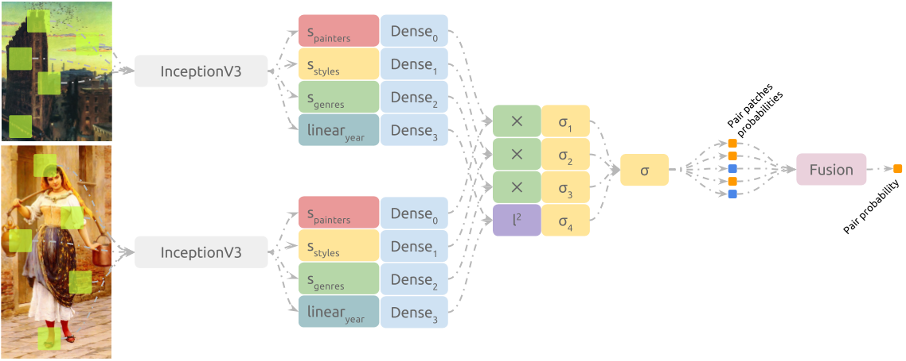

## Reports

### van Gogh's

van Gogh's dataset is composed by 264 train samples and 67 test samples,
discriminated by the non van Gogh (nvg) and van Gogh (vg) labels.

#### InceptionV3, PCA and SVM

So far, the method responsible for best classification accuracy in the test
set is as follows:


1. `1-extract-patches.py` is used to extract 50 random patches with sizes
(299, 299, 3) from each sample in train and test folders.
2. `4a-embed-patches.py` is executed. Using InceptionV3 architecture and
its weights trained over imagenet dataset, patches are embedded to a lower
dimensional space (cut-point is `GlobalAveragePooling2d(name='avg_pool')` layer).
3. `5-train-top-classifier` trains a PCA --> SVM pipeline that classifies
patches according to their labels.
4. `6-evaluate-fusion` fuses the answers from the model trained above over the
test dataset using each strategy (e.g. sum, mean, farthest, most_frequent) and
reports results. Best values are shown bellow:

   ```
   test score using sum strategy: 0.955223880597

   Confusion matrix:
       nvg  vg
   nvg 39    3
    vg  0   25

   samples incorrectly classified: nvg_10658644, nvg_10500055 and nvg_18195595.
   ```

#### DenseNet264, PCA and SVM

1. `1-extract-patches.py` is used to extract 50 random patches with sizes
(32, 32, 3) from each sample in train and test folders.
2. `2-train-network.py` trains `DenseNet264` over the extracted patches.
3. `3-optional-generate-network-predictions.py` shows the following results:

   ```
   valid patches score using: 0.846538461538
   Confusion matrix:
        nvg   vg
   nvg 1403  197
    vg  202  798

   valid score using farthest strategy: 0.942307692308
   Confusion matrix:
       nvg   vg
   nvg  32    0
    vg   3   17

   test patches score using: 0.842089552239
   Confusion matrix:
        nvg   vg
   nvg 1746  354
    vg  175 1075

   test score using farthest strategy: 0.925373134328
       nvg   vg
   nvg  39    3
    vg   2   23

   samples incorrectly classified: nvg_10658644, nvg_9780042, nvg_6860814,
                                   vg_17177301 and vg_33566806.
   ```

4. `4a-embed-patches.py` is executed. Using DenseNet264 architecture trained
in the previous step, patches are embedded to a lower dimensional space
(cut-point is `GlobalAveragePooling2d(name='avg_pool')` layer).
5. `5-train-top-classifier` trains a PCA --> SVM pipeline that classifies
patches according to their labels. One interesting result here is that PCA
reduces the network output to only 4 dimensions, making the rest of the
classification pipeline very efficient.
6. `6-evaluate-fusion` fuses the answers from the model trained above over the
test dataset using each strategy (e.g. sum, mean, farthest, most_frequent) and
reports results. Best values are shown bellow:

   ```
   test patches score: 0.870149253731

   Confusion matrix:
         nvg   vg
    nvg 1878  222
     vg  213 1037

   test score using mean strategy: 0.910447761194

   Confusion matrix:
         nvg   vg
    nvg   39    3
    vg     3   22

   samples incorrectly classified: vg_33566806, nvg_10658644, vg_17177301, vg_9463608,
                                   nvg_6860814 and nvg_9780042.
   ```

#### Further Testing

The previous classifiers performed well when applied to the test paintings.
How well would they perform on recaptures of those same paintings and
different van Gogh paintings?

When gathering the recaptures datasets, I reached for closer resolutions
to the ones presented in vgdb2016 whenever available. Unfortunately, while the
vgdb2016 contains huge files, recaptures from google were recurrently smaller
than (2000px, 2000px).

```shell
general statistics on test paintings in vgdb_2016:
  min sizes: (1016 px 1044 px)
  avg sizes: (3115 px 2805 px)
  max sizes: (7172 px 7243 px)
  min  area: 1419840 px**2
  avg  area: 10047495 px**2
  max  area: 45355666 px**2
```

In order to attempt to measure this difference in the process, two strategies
are considered:

1. none: images were used as they were when retrieved.
2. resized: images are resized to either match their correspondent's width
          in vgdb2016 (if they are recaptures) or the average width in
          vgdb2016 (if they are unseen images).


##### Recaptures from van Gogh Museum

Recaptures from images in vgdb2016 test set were retrieved from the vangogh museum webiste.

| clf | extracted patches | transf. | patch confusion m. | best | confusion m. | acc. |
| --- | --- | --- | --- | --- | --- | --- |
| svm | random | none | 0 0<br>288 112 | frequent | 0 0<br>6 2 | **25%** |
| svm | random | resized | 0 0<br>302 98 | mean, farthest, frequent | 0 0<br>7 1 | 13% |
| svm | min-grad | none | 0 0<br>293 107 | mean, farthest, frequent | 0 0<br>7 1 | 13% |
| svm | min-grad | resized | 0 0<br>317 83 | mean, farthest | 0 0<br>7 1 | 13% |
| densenet264 | random | none | 0 0<br>390 10 | farthest | 0 0<br>8 0 | 0% |
| densenet264 | random | resized | 0 0<br>373 27 | farthest | 0 0<br>7 1 | 13% |

##### van Gogh Museum Unseen

Images of paintings that do not appear in vgdb2016 were retrieved from the
vangogh museum website.

| clf | extracted patches | transf. | patch confusion m. | best | confusion m. | acc. |
| --- | --- | --- | --- | --- | --- | --- |
| svm | random | none | 474 76<br>941 759 | mean, farthest | 10 1<br>20 14 | 66% |
| svm | random | resized | 469 81<br>979 721 | frequent | 11 0<br>19 15 | **72%** |
| svm | min-grad | none | 466 84<br>941 759 | farthest | 11 0<br>20 14 | 71% |
| svm | min-grad | resized | 472 78<br>956 744 | farthest | 10 1<br>19 15 | 68% |
| densenet264 | random | none | 473 77<br>1512 188 | farthest | 8 3<br>26 8 | 48% |
| densenet264 | random | resized | 497 53<br>1530 170 | farthest | 10 1<br>26 8 | 57% |


##### Recaptures from multiple places

Recaptures from images in vgdb2016 test set were retrieved from multiple
placed, found using google image search.

| clf | extracted patches | transf. | patch confusion m. | best | confusion m. | acc. |
| --- | --- | --- | --- | --- | --- | --- |
| svm | random | none | 3883 367<br>969 1881 | frequent | 82 3<br>19 38 | **82%** |
| svm | random | resized | 3697 553<br>921 1929 | farthest | 78 7<br>19 38 | 79% |
| svm | min-grad | none | 3836 414<br>927 1923 | mean, frequent | 82 3<br>19 38 | **82%** |
| svm | min-grad | resized | 3642 608<br>905 1945 | frequent | 79 6<br>19 38 | 80% |
| densenet264 | random | none | 3837 413<br>1890 960 | mean | 81 4<br>40 17 | 63% |
| densenet264 | random | resized | 3910 340<br>1887 963 | farthest | 79 6<br>34 23 | 67% |

###### Combining Recaptures

Recaptures were grouped by the painting the contain and `frequent` is used
to form a final classification for the painting.

```
class-normalized accuracy: 86.68%
Confusion matrix:
 37 (97%)  1
  6       19 (76%)
samples incorrectly classified: nvg/nvg_10500055 vg/vg_9103139 vg/vg_9386980 vg/vg_9387502
                                vg/vg_9414279 vg/vg_9421984 vg/vg_9463012 
```

Adding the paintings from vangogh2016/test as recaptures:

```
class-normalized accuracy: 92.43%
Confusion matrix:
39 (93%)  3
 2       23 (92%)
samples incorrectly classified: nvg/nvg_10500055 nvg/nvg_10658644 nvg/nvg_18195595
                                vg/vg_9103139 vg/vg_9414279
```

---

### Painter by Numbers

Containing many paintings from 1564 painters, this dataset was made available
in Kaggle's [Painter-by-Numbers](https://www.kaggle.com/c/painter-by-numbers)
competition. We also have access to meta-data associated with the paintings
(e.g. style, genre and year created).

While we can interpret the training phase as a multiclass problem, the test
phase consists in deciding whether or not two paintings belonging to a same
artist.

Score is computed by ROC AUC between an estimated probabilities and the actual
label (0.0 or 1.0).

#### Siamese InceptionV3, PCA, SVC, Equal Joint

The 100 first painters (sorted by their hash code) were considered and the
pipeline described bellow.


We can see from the train confusion matrix and the test report bellow that the
model performed well for the 100 artists selected in training, but clearly
overfitted the data and missed many samples associated with the label
`same-artist`.



```
score using farthest strategy: 0.70295719844

Confusion matrix:

                    different-painters same-painter
different-painters            15289495      6339202
      same-painter              170802       116548
```

#### Siamese Fine-tuned InceptionV3, Custom Joint



1. `1-extract-patches.py` is used to extract 50 random patches with sizes
(299, 299, 3) from each sample in train and test folders.
2. `2-train-network.py` fine-tunes InceptionV3 (transferred from imagenet)
to the train dataset, associating patches to their respective painters.
4. `3a-generate-network-answers` feed-forwards each test painting's test
through the network trained in the previous step. Let `y` be the fined-tuned
InceptionV3 and `a` and `b` be paintings in a pair described in
`submission_info.csv`:
   - **Equal Joint** Patches probabilities are fused using each strategy,
     leaving us with the probabilities of a work belonging to each one of the
     1584 painters. The probability of these being of a same painting is
     computed by `argmax(y(a)) == argmax(y(b))`. Results are shown bellow:

     ```
     roc auc score using mean strategy: ?

     Confusion matrix:

                         different-painters same-painter
     different-painters            21593154        35543
           same-painter              214767        72583
     ```

   - **Dot Joint** patches probabilities are fused using `mean` strategy,
     leaving us with the probabilities of a work belonging to each one of the
     1584 painters. The probability of these being of a same painting is
     computed by `y(a).dot(y(b))`. Results are shown bellow:

     ```
     roc auc score using mean strategy: 0.902789501328

     Confusion matrix:

                         different-painters same-painter
     different-painters            21627458         1239
           same-painter              261844        25506
     ```

   - **Pearsonr Joint** patches probabilities are fused using `mean` strategy,
     leaving us with the probabilities of a work belonging to each one of the
     1584 painters. The probability of these being of a same painting is
     computed by `scipy.stat.pearsonr(y(a), y(b))[0]`. Results are shown bellow:

     ```
     roc auc score using mean strategy: 0.880932204226

     Confusion matrix:

                         different-painters   same-painter
     different-painters     21588252 (100%)    40445  (0%)
           same-painter       207041  (72%)    80309 (28%)
     ```

#### Siamese Fine-tuned InceptionV3, Embedding Dense Layers, l^2 Joint

The limbs of the network trained in [Siamese Fine-tuned InceptionV3, Custom Joint](#siamese-fine-tuned-inceptionv3-custom-joint)
are used to compose a new network (frozen weights), illustrated in the diagram
bellow:


```
roc auc: 0.831379516462
accuracy normalized by class-frequency: 73.5%

Confusion matrix:

                    different-painters   same-painter
different-painters      17965397 (83%)  3663300 (17%)
      same-painter        103340 (36%)   184010 (64%)
```


#### Siamese Fine-tuned InceptionV3, Embedding Dense Layers, Sigmoid Joint

The limbs of the network trained in [Siamese Fine-tuned InceptionV3, Custom Joint](#siamese-fine-tuned-inceptionv3-custom-joint)
are used to compose a new network (frozen weights), illustrated in the diagram
bellow:


```
roc auc using mean strategy: 0.865582232769
accuracy normalized by class-frequency: 78%

Confusion matrix:

                    different-painters   same-painter
different-painters      16418044 (76%)  5210653 (24%)
      same-painter         56919 (20%)   230431 (80%)
```


##### Siamese Multi-label Fine-tuned InceptionV3, Embedding Dense Layers, Sigmoid Joint


```
roc auc score using mean strategy: 0.913406464881
accuracy normalized by class-frequency: 80%

Confusion matrix:

                    different-painters   same-painter
different-painters      20069328 (93%)  1559369  (7%)
      same-painter         95072 (33%)   192278 (67%)
```


##### Siamese Multi-branch Fine-tuned InceptionV3, Embedding Dense Layers, Sigmoid Joints



| limb | branches used | embedding units | roc auc | acc | confusion matrix diag. |
| --- | --- | --- | --- | --- | --- |
| InceptionV3 softmax | artist, style, genre | 1024, 256, 256 | .898 | .914 | .9176 .6295 |
| InceptionV3 sigmoid | artist, style, genre | 1024, 256, 256 | ? | ? | ? |
| InceptionV3 sigmoid | artist, style, genre | 2048, 256, 128 | ? | ? | ? |
| InceptionResNetV2 sigmoid | artist, style, genre | 2048, 256, 128 | ? | ? | ? |
